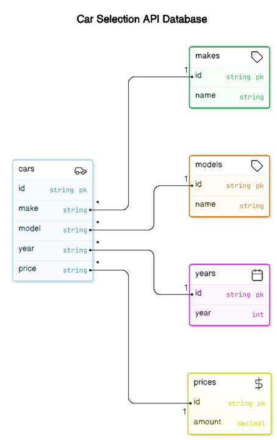

# Car Finder

A repository for finding car make, model, and price with purchasing functionality. This project includes two primary APIs: one for vehicle data retrieval and another for shopping cart management.

## Features

- **API 1:** Provides the make, model, and price of vehicles.
- **API 2:** Handles shopping cart functionality for purchasing cars.

## User Story

As a user, I want to search for cars by specific criteria such as make, model, price, and year, compare different vehicles, and purchase a selected vehicle using a shopping cart.

## Acceptance Criteria

- The system should prompt the user for details such as vehicle type, price range, make, model, and year.
- The user should be able to view and compare vehicles in a structured table format.
- Once a car is selected, the user can add it to a shopping cart for purchase.

## Project Setup

* Cars
  * id: Name String
  * make: id name string
  * Model: id name string
  * Year: id year int
  * Price: id amount decimal

### Frontend Details

The front end will provide the user interface for vehicle search, comparison, and shopping cart management.

### Backend Details

The backend will manage vehicle data retrieval and process transactions, similar to the front-end functionality but focused on API calls and data handling.

## Project Description

Car Finder enables users to easily search for vehicles, compare them side-by-side, and complete a purchase, all in one seamless experience.

### Required Modules

- **PostgreSQL** - For managing the car database and storing vehicle and user information.
- **Node.js** - For server-side API development.

## Table of Contents

 - [Installation](#installation)
 - [Usage](#usage)
 - [Testing](#testing)
 - [Contributing](#contributing)
 - [Questions](#questions)

## Installation

1. Clone the repository:  
   `git clone https://github.com/Bugatti1982/Car-Finder`
2. Install dependencies:  
   `npm install`
3. Set up the PostgreSQL database using the provided schema.
4. Run the application:  
   `npm start`

## Video Demonstration

_A video demonstration link will be added here once the project is fully implemented._

## Usage

After installation, launch the app to search for vehicles, compare them and add your preferred vehicle to the shopping cart for purchase.

## Testing

Testing functionality is not currently implemented. Future updates will include testing configurations.

## Contributors

Bee Vang

Rachel Reyes

Brandon Welch

Mattison Anderson

Brandi Rasmussen

Marcellus Khanyoo-Moona

### Resources

- [Markdown Editor](https://stackedit.io/)
- [AI co-pilot ‍for technical design](https://eraser.io)
- [Product Price Comparison in SQL](https://stackoverflow.com/questions/19841022/product-price-comparison-in-sql)
- [HTML & CSS Price Comparison Table Tutorial](https://www.youtube.com/watch?v=Ki2HbIMZTgg)
- [Learn Express JS in 35 minutes](https://www.youtube.com/watch?v=SccSCuHhOw0)
- [Setup React with Vite](https://dev.to/mcbarna/setup-react-with-vite-on-vscode-a-step-by-step-tutorial-591g)

## Questions

For questions or further assistance, feel free to reach out via GitHub or raise an issue in the repository.

##### Production Notes from Meetings

Meeting Notes from Oct 5

Rachel is working on SQL & Scheema

	* We need to look at if we should create a database from scratch or just use the database that we    
     pulled

	* Is it more time efficient?

	* We are asking Chat GPT and Nate their options on it

API

Brandon is working on Routing

	* He is doing research and BEE and Rachel are working with him in support

	* We are trying to figure out what we need to do on this currently to support Brandon

Bee has updated the Front end and we have a good Outline and look for website

   * Bee will lead with the the front end of the site. 

	* Bee and Brandi are going to sit down and discuss the vision of the site on Monday Oct 7.

	* Brandi will go in and write up the Markdown for the site as Bee explains what he has done.

	* Bee will supervise the technical aspect and review code and lean in when necessary.
	
Brandi is going to do Production supervision

	* Brandi work on front end with Bee

	* Brandi will lean in and write markdown

	* Brandi will assist with Bee on the vision and front end

   * Brandi will also be taking production notes to keep us on task and have a good timeline

   * Brandi will also look at how to keep things effient so that we don't get lost in the minutia.
   

Marcellus will meet with us on Sunday Oct 6 10:00am to discuss assigned tasks we will assign his tasks at that time.

Mattison has not contacted us yet on a time he can meet so we can discuss his tasks.

